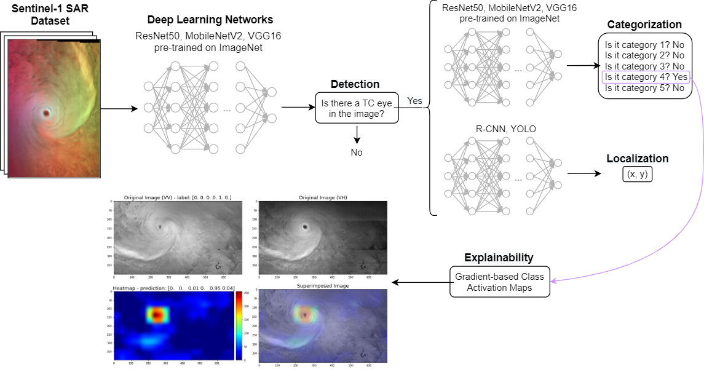

# Tropical Cyclones


## Overview
This repository holds an application of computer vision to the detection and categorization of Tropical Cyclones (TC) using Sentinel-1 Synthetic Aperture Radar data. This project is the result of a joint research collaboration between the Φ-lab (ESRIN/ESA) and Ifremer. 

The code developed was used for the following publication to [IGARSS 2021](https://ieeexplore.ieee.org/document/9554111):
> A. R. Carmo, N. Longépé, A. Mouche, D. Amorosi and N. Cremer, **Deep Learning Approach for Tropical Cyclones Classification based on C-Band Sentinel-1 SAR Images**, 2021 IEEE International Geoscience and Remote Sensing Symposium IGARSS, 2021, pp. 3010-3013, doi:10.1109/IGARSS47720.2021.9554111.

This repository is intended as a means to reproduce the results shown in the paper and to stimulate further research in this direction.

## Installation
To install requirements: `pip install -r requirements.txt`

## Contents
This repository contains the following:
  1. the source code of the project in the `code` folder;
  2. demonstration Jupyter notebooks in the `notebooks` folder, to reproduce the same results as the scripts in python;
  3. pre-trained models in the `models` folder;
  4. `requirements.txt` containing the packages that require installation in order to run the code;
  5. `config.yml` containing the configuration variables needed to run the scripts.

## Data
The data was kindly collected and provided in open access by Ifremer, through the [CyclObs API](https://cyclobs.ifremer.fr/app/docs/). The data can be downloaded using the `data_download.py` script in the `code` folder via
```python
python code/data_download.py
``` 
The directory to store the images should be configured in the `data_path` variable from the configuration file `config.yml`. 

#### Extraction from API
Initially, **.nc** products will be downloaded from the CyclObs API and stored in a folder called `SAR_swath_nc`, which will contain the files stratified by category, i.e. distributed over 5 different folders named `categoryX`, where 'X' represents each of the categories from 1 to 5.

#### Convertion from .nc to .png
In this stage, and depending on the SAR features selected (max. 3, one for each channel of the resulting image), each feature will be extracted from each .nc product and stacked along the 3rd-axis to create an image (stored as .png). For this, a new folder will be created with the prefix `SAR_images_swath_`, followed by the features' siglas. Inside this folder, 6 additional folders will be created:
  - a `csv` folder containing files (csv) with the full dataset and respective labels;
  - 5 folders named `categoryX`, where 'X' represents each of the categories 1 to 5, containing the images of all TCs from that category.

## Usage
#### Detection
Performing the detection of Tropical Cyclones requires a configuration file defining the model parameters, training procedure and logging parameters, which can be found in `config.yml`. Training is run via the script `detection.py` as follows
```python
python code/detection.py
```
This will create the directory specified as `results_path` in the configuration file `config.yml`, containing the scores, saved models and logs.
#### Categorization
Performing the categorization involves similar steps as the detection task, except the script name, which is called `categorization.py` and is used as follows
```python
python code/categorization.py
```
